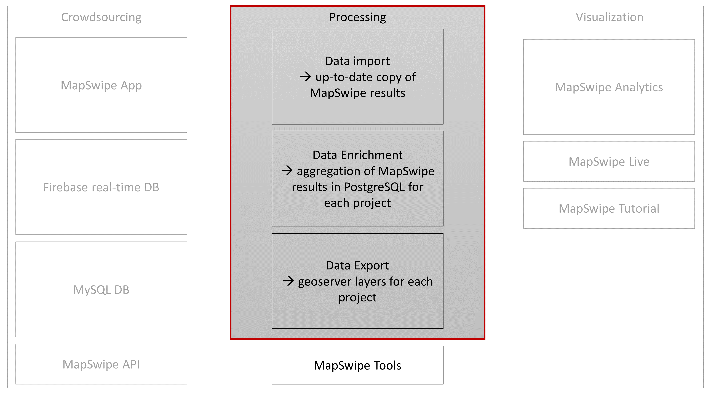

# MapSwipe Analytics Backend

The diagram provides an overview of the role of this repo towards other MapSwipe related projects. Processing is the central to offer our MapSwipe related services and consists of three major submodules: import, enrichment and export. All submodules are combined in the [processing_workflow](/processing_workflow/readme.md).

Have a look at the documentation of each sub module:
* [import](/data import/readme.md): data is extracted from the mapswipe MySQL database
* [enrichment](/data enrichment/readme.md): we calculate agreement, number of contributors, aggregated answer for each task and project
* [export](/data export/readme.md): geoserver is utilized to serve MapSwipe data

